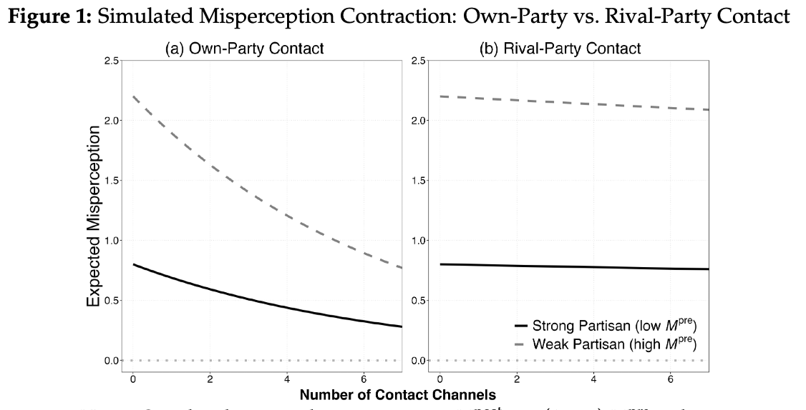
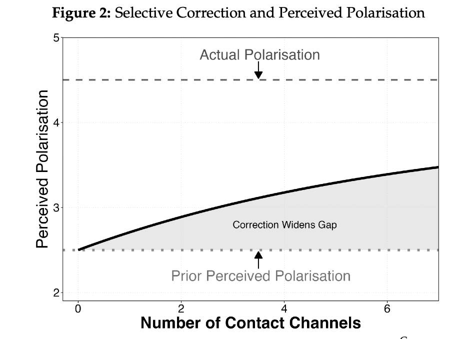
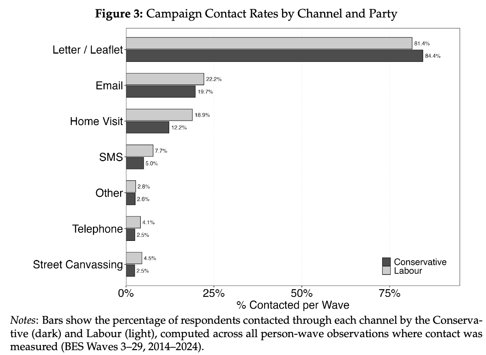
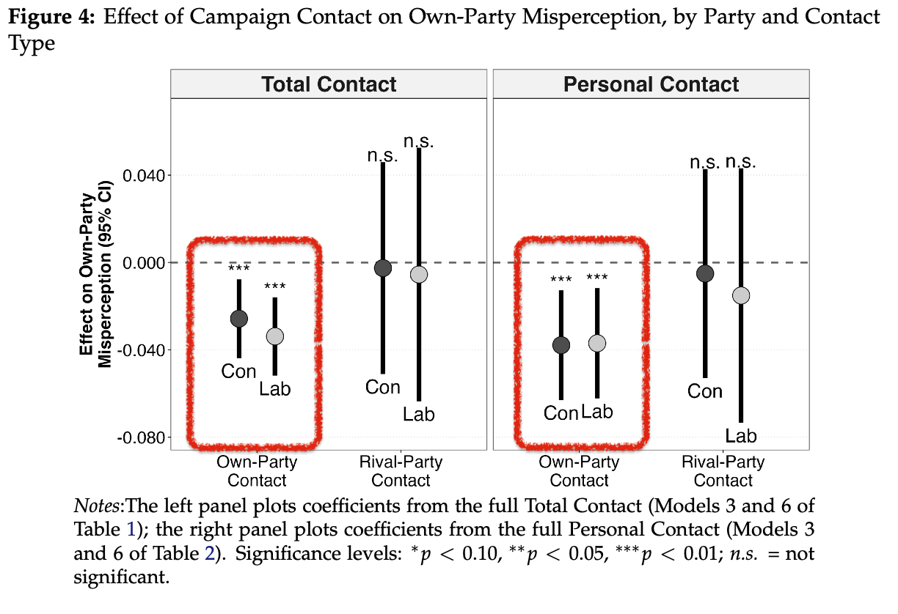
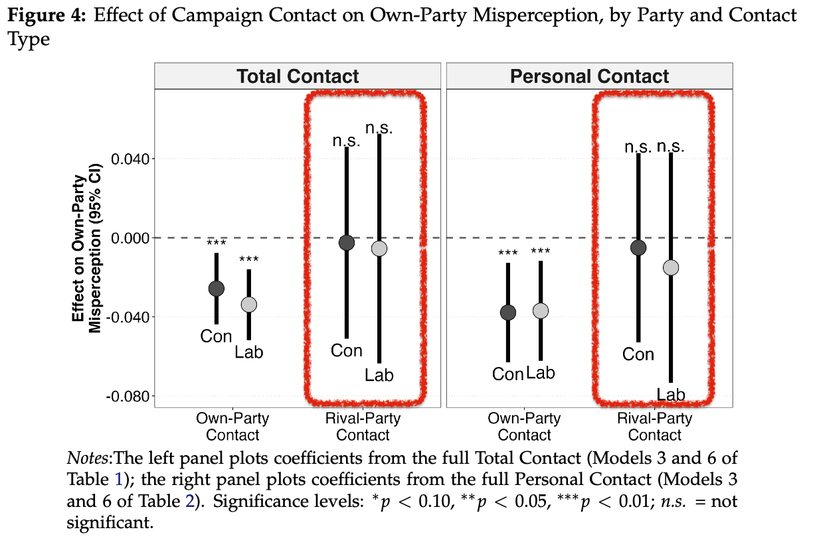
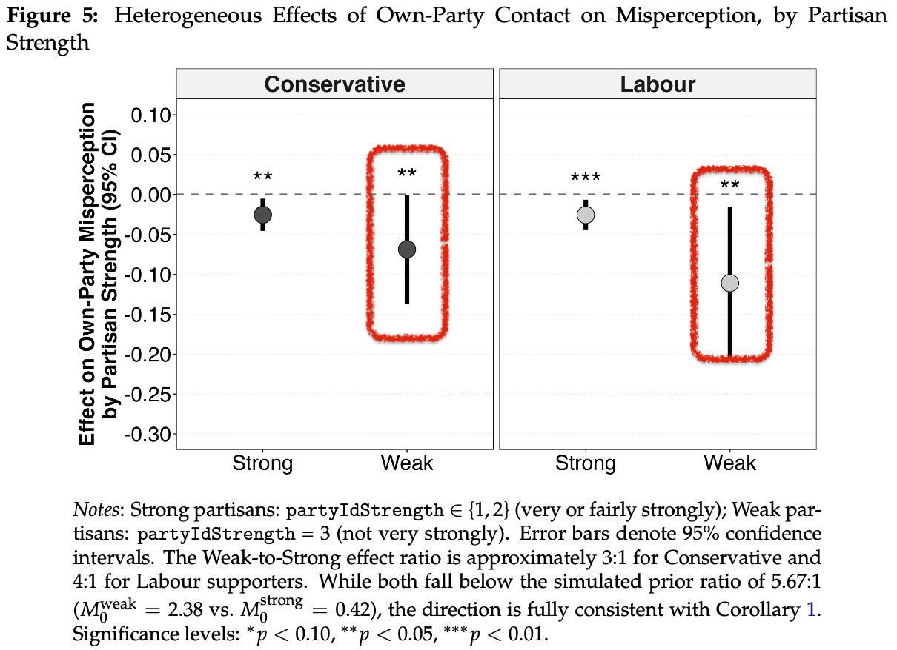
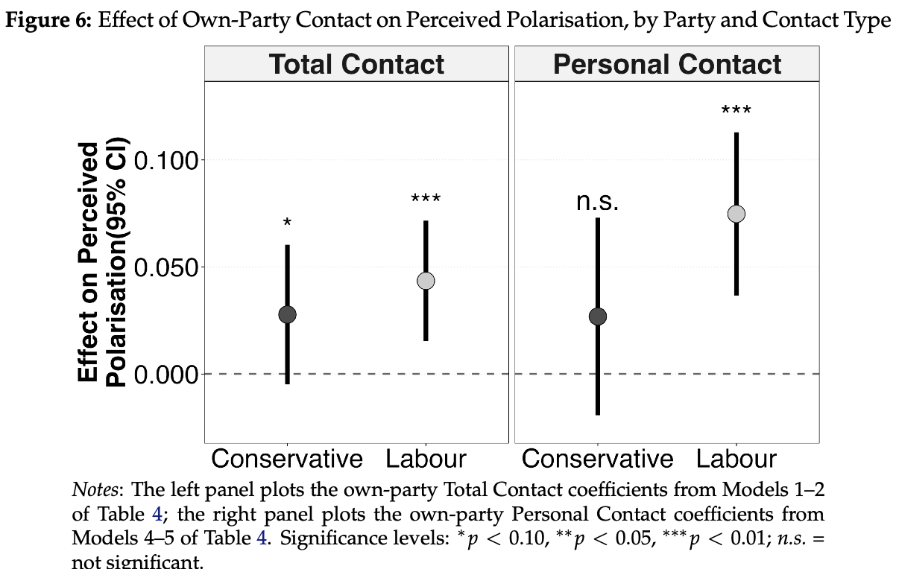
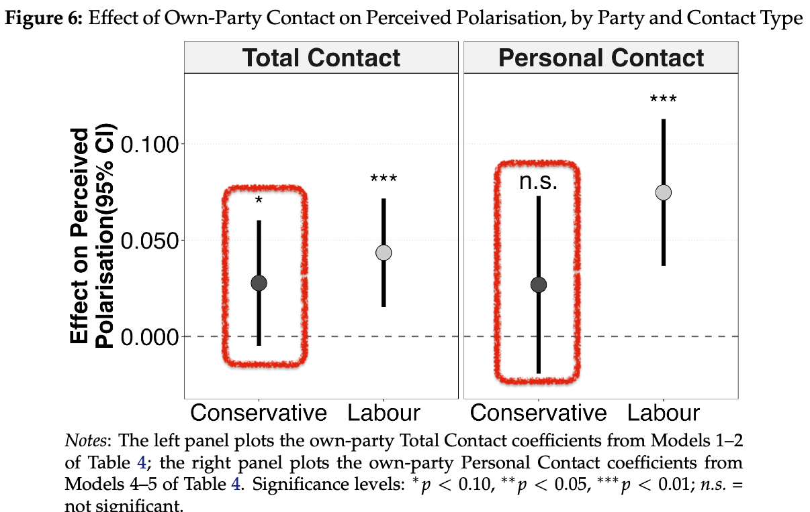
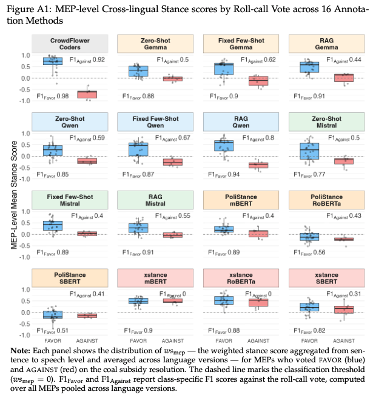

exclude: true
```{r setup, include=FALSE}
library(knitr)
library(ggplot2)
library(dplyr)
red_pink   = "#e64173"
turquoise  = "#20B2AA"
orange     = "#FFA500"
red        = "#fb6107"
blue       = "#3b3b9a"
green      = "#8bb174"
grey_light = "grey70"
grey_mid   = "grey50"
grey_dark  = "grey20"
purple     = "#6A5ACD"
opts_chunk$set(
  comment = "#>",
  fig.align = "center",
  fig.height = 6,
  fig.width = 9,
  warning = FALSE,
  message = FALSE,
  dev = "svg"
)
# 
# pagedown::chrome_print(
#   paste0("file://", here::here("epss-slides.html")),
#   verbose = FALSE
# )
# pagedown::chrome_print(
#   input = here::here("polmeth-slides.Rmd"),
#   output = here::here("polmeth-slides.pdf")
```
---

exclude: true


---
layout: true
# .tiny[Motivation]
---
name:overview

&nbsp;

.huge.hi-grey[**Do Canvassing inform** voters, or merely **reinforce** existing beliefs?]

.pull-left[

<!-- - Classic view: minimal persuasion effects on **vote choice**  (Lazarsfeld et al. 1968; Kalla & Broockman 2018) -->
<!-- - Yet campaigns may still shape what voters **believe** about parties -->

<!-- **Our question:** Does door-to-door canvassing change voters' *perceptions of party positions* — and does it matter *who* is knocking? -->
]

.pull-right[

```{r echo = F, out.width = "90%"}
knitr::include_graphics("./figure/canvasing.png")

```
]

---


&nbsp;

.huge.hi-grey[**Do Canvassing inform** voters, or merely **reinforce** existing beliefs?]

.pull-left[

- Classic view: minimal persuasion effects on **vote choice**  (Lazarsfeld et al. 1968; Kalla & Broockman 2018)
<!-- - Yet campaigns may still shape what voters **believe** about parties -->

<!-- **Our question:** Does door-to-door canvassing change voters' *perceptions of party positions* — and does it matter *who* is knocking? -->
]

.pull-right[

```{r echo = F, out.width = "90%"}
knitr::include_graphics("./figure/canvasing.png")

```
]


---

&nbsp;

.huge.hi-grey[**Do Canvassing inform** voters, or merely **reinforce** existing beliefs?]

.pull-left[

- Classic view: minimal persuasion effects on **vote choice**  (Lazarsfeld et al. 1968; Kalla & Broockman 2018)
- In the UK, door-knocking remains a central feature of how political parties campaign.

<!-- **Our question:** Does door-to-door canvassing change voters' *perceptions of party positions* — and does it matter *who* is knocking? -->
]

.pull-right[

```{r echo = F, out.width = "90%"}
knitr::include_graphics("./figure/canvasing.png")

```
]


---


&nbsp;

.huge.hi-grey[**Do Canvassing inform** voters, or merely **reinforce** existing beliefs?]

.pull-left[

- Classic view: minimal persuasion effects on **vote choice**  (Lazarsfeld et al. 1968; Kalla & Broockman 2018)
- In the UK, door-knocking remains a central feature of how political parties campaign.

.hi-grey[**Here's the question we want to push on:**]<br>Does it change what voters believe? Does it change how accurately voters perceive where their own party stands?
]

.pull-right[

```{r echo = F, out.width = "90%"}
knitr::include_graphics("./figure/canvasing.png")

```
]

---
layout: true
# .tiny[The Puzzle]
---


&nbsp;

.huge.hi-grey[Voters frequently **misperceive** where parties stand on the left–right scale.]

.pull-left[

- **Misperception** 
<!-- - Misperception has downstream effects on accountability, polarisation, and vote choice (Ahler & Sood 2018; Carroll, Liao & Tang 2025) -->


]

.pull-right[

**Two competing possibilities:**

<!-- | Scenario | | Prediction | -->
<!-- |----------| |------------| -->
<!-- | Campaigns inform | | All contact reduces misperception | -->
<!-- | Partisan filtering| | Only *own-party* contact matters | -->

]

---


&nbsp;

.huge.hi-grey[Voters frequently **misperceive** where parties stand on the left–right scale.]

.pull-left[

- **Misperception** is common and has downstream effects, e.g., polarisation  (Carroll, Liao & Tang 2025)


]

.pull-right[

**Two competing possibilities:**

<!-- | Scenario | | Prediction | -->
<!-- |----------| |------------| -->
<!-- | Campaigns inform | | All contact reduces misperception | -->
<!-- | Partisan filtering| | Only own-party contact matters | -->


]


---

&nbsp;

.huge.hi-grey[Voters frequently **misperceive** where parties stand on the left–right scale.]

.pull-left[

- **Misperception** is common and has downstream effects, e.g., polarisation  (Carroll, Liao & Tang 2025)
- **The puzzle**: Can partisan canvasing actually correct these misperceptions?


]


.pull-right[
**Two competing possibilities:**

<!-- | Scenario | | Prediction | -->
<!-- |----------| |------------| -->
<!-- | **Campaigns inform** | | All contact reduces misperception | -->
<!-- | **Partisan filtering**| | Only own-party contact matters | -->

]

---


&nbsp;

.huge.hi-grey[Voters frequently **misperceive** where parties stand on the left–right scale.]

.pull-left[

- **Misperception** is common and has downstream effects, e.g., polarisation  (Carroll, Liao & Tang 2025)
- **The puzzle**: Can partisan canvasing actually correct these misperceptions?
- Here's the twist — not all contact is equal. 


]


.pull-right[

**Two competing possibilities:**

| Scenario | | Prediction |
|----------| |------------|
| **Campaigns inform** | | All contact reduces misperception |
| **Partisan filtering**| | Only own-party contact matters |


]


---


&nbsp;

.huge.hi-grey[Voters frequently **misperceive** where parties stand on the left–right scale.]

.pull-left[

- **Misperception** is common and has downstream effects, e.g., polarisation  (Carroll, Liao & Tang 2025)
- **The puzzle**: Can partisan canvasing actually correct these misperceptions?
- Here's the twist — not all contact is equal. 

]


.pull-right[

**Two competing possibilities:**

| Scenario | | Prediction |
|----------| |------------|
| **Campaigns inform** | | All contact reduces misperception |
| **Partisan filtering**| | Only own-party contact matters |

]

- We argue it all comes down to one question: **whose signal** do voters usually trust?


---
layout: true
# .tiny[Theory: Identity-Weighted Belief Updating]
---


- Voters update beliefs through a **partisan lens** (Zaller 1992; Taber & Lodge 2006) - how much information voters update depends on who's at the door.

--

-  $$\mu_i^{p,\text{post}} = (1 - \color{#fb6107}\kappa_i^p)\,\mu_i^{p,\text{pre}} + \color{#fb6107} \kappa_i^p\, s_i^p$$

--

  - When ${\color{#fb6107} \kappa_i^p = \color{#fb6107}0}$: &nbsp; $\mu_i^{p,\text{post}} = \mu_i^{p,\text{pre}}$ &nbsp;→ .hi-slate[canvasser's signal is completely ignored]

--

  - When ${\color{#44C1C4} \kappa_i^p = \color{#44C1C4}1}$: &nbsp; $\mu_i^{p,\text{post}} = s_i^p$ &nbsp;→ .hi-slate[fully believe canvasser]

--

- Most voters are somewhere in between — and *where* depends on .hi[**who's at the door**]

<!-- -- -->

<!-- - and where responsiveness $\kappa$ depends on partisan source: -->

<!-- $$\kappa_i^p = \sigma\!\left(\lambda\,[t_H C_i^{\text{own}} + t_L C_i^{\text{rival}}]\right)$$ -->
<!-- - $t_H \gg t_L$: .hi-turquoise[own-party] messages **trusted**; .hi-red[rival] messages **discounted** -->

---


- Voters update beliefs through a **partisan lens** (Zaller 1992; Taber & Lodge 2006) - how much information voters update depends on who's at the door.
  
-  $$\mu_i^{p,\text{post}} = (1 - \color{#fb6107}\kappa_i^p)\,\mu_i^{p,\text{pre}} + \color{#fb6107} \kappa_i^p\, s_i^p$$

  - When ${\color{#fb6107} \kappa_i^p = \color{#fb6107}0}$: &nbsp; $\mu_i^{p,\text{post}} = \mu_i^{p,\text{pre}}$ &nbsp;→ .hi-slate[canvasser's signal is completely ignored]

  - When ${\color{#44C1C4} \kappa_i^p = \color{#44C1C4}1}$: &nbsp; $\mu_i^{p,\text{post}} = s_i^p$ &nbsp;→ .hi-slate[fully believe canvasser]

- Most voters are somewhere in between — and *where* depends on .hi[**who's at the door**]

- and where responsiveness $\kappa$ depends on partisan source:

<!-- $$\kappa_i^p = \sigma\!\left(\lambda\left[\underbrace{t_H C_i^{\text{own}}}_{\text{own party}} + \underbrace{t_L C_i^{\text{rival}}}_{\text{rival party}}\right]\right)$$ -->

$$\kappa_i^p = \sigma\!\left(\lambda\,[t_H C_i^{\text{own}} + t_L C_i^{\text{rival}}]\right)$$ 

<!-- <span style="font-size: 30%;"> -->
<!-- $$\kappa_i^p = \sigma\!\left(\lambda\left[\underbrace{t_H C_i^{\text{own}}}_{\text{own party}} + \underbrace{t_L C_i^{\text{rival}}}_{\text{rival party}}\right]\right)$$ -->
</span>

- $t_H \gg t_L$: .hi-turquoise[own-party] messages **trusted**; .hi-red[rival] messages **discounted**

--

- Same contact generates completely different beliefs

--

- __Contraction__: So own-party canvassing acts as a correction: every contact pulls voters' belief a little closer to where the party actually stands, while rival contact barely moves anything.


---
layout: true
# .tiny[Simulation Ⅰ and Proposition 1 and 2]
---

&nbsp;


```{r echo=FALSE, out.width="80%"}

```


---

&nbsp;

.pull-left[

```{r echo=FALSE, out.width="100%"}

```

]

.pull-right[
- $\underline{\textbf{Prop. 1}}$ Own-party contact **reduces** misperception
<!-- - **P2** Rival-party contact has **no effect** ($t_L \approx 0$) -->
<!-- - **P3** Own-party contact **increases** perceived polarisation -->
<!--   + (corrects centrist bias → widens perceived gap) -->
<!-- - **P4** Effects larger for **weak partisans** -->
<!--   + (noisier priors → more room to correct) -->

]

---


&nbsp;

.pull-left[

```{r echo=FALSE, out.width="110%"}

```

]

.pull-right[
- $\underline{\textbf{Prop. 1}}$ Own-party contact **reduces** misperception
- $\underline{\textbf{Prop. 2}}$ Rival-party contact has **no effect** ($t_L \approx 0$)
<!-- - **P3** Own-party contact **increases** perceived polarisation -->
<!--   + (corrects centrist bias → widens perceived gap) -->
<!-- - **P4** Effects larger for **weak partisans** -->
<!--   + (noisier priors → more room to correct) -->

]


---
layout: true
# .tiny[Simulation Ⅱ and Proposition 3 and 4]
---


- The more contact channels voters are exposed to, the more polarised their perceptions become.

```{r echo=FALSE, out.width="70%"}

```

---

&nbsp;

.pull-left[

```{r echo=FALSE, out.width="110%"}

```

]

.pull-right[
- $\underline{\textbf{Prop. 3}}$ Own-party contact **increases** perceived polarisation
  + (corrects centrist bias → widens perceived gap)
<!-- - **P4** Effects larger for **weak partisans** -->
<!--   + (noisier priors → more room to correct) -->

]


---


&nbsp;

.pull-left[

```{r echo=FALSE, out.width="110%"}

```

]

.pull-right[
- $\underline{\textbf{Prop. 3}}$ Own-party contact **increases** perceived polarisation
  + (corrects centrist bias → widens perceived gap)
- $\underline{\textbf{Prop. 4}}$ Effects larger for **weak partisans**
  + (noisier priors → more room to correct)

]


---
layout: true
# .tiny[Data: British Election Study Internet Panel]
---

.pull-left[
.hi-grey[**BES Internet Panel** (Fieldhouse et al. 2024)]
- Waves 3–29, **2014–2024** (4 general elections)
- 4 general elections
- Rich contact battery: **7 channels** per party


<!-- **Why BES?** -->

<!-- - Same individuals tracked across elections → within-person variation in canvassing -->
<!-- - Decade spanning Corbyn shift, Brexit, Starmer realignment -->
<!-- - Rich contact battery: **7 channels** per party -->

]

.pull-right[
&nbsp;

```{r echo=FALSE, out.width="110%"}

```

]


---


.pull-left[
.hi-grey[**BES Internet Panel** (Fieldhouse et al. 2024)]
- Waves 3–29, **2014–2024** (4 general elections)
- 4 general elections
- Rich contact battery: **7 channels** per party


.hi-grey[**Why BES?**]
- Same individuals tracked across elections → within-person variation in canvassing
- ~44,120 person-wave observations
]

.pull-right[
&nbsp;

```{r echo=FALSE, out.width="110%"}

```

]
---


.pull-left[
.hi-grey[**BES Internet Panel** (Fieldhouse et al. 2024)]

- Waves 3–29, **2014–2024** (4 general elections)
- 4 general elections
- Rich contact battery: **7 channels** per party

.hi-grey[**Why BES?**]
- Same individuals tracked across elections → within-person variation in canvassing
- ~44,120 person-wave observations
- Decade spanning Corbyn shift, Brexit, Starmer realignment

]

.pull-right[
&nbsp;

```{r echo=FALSE, out.width="110%"}

```

]


---
layout: true
# .tiny[Data: Measurement & Design]
---


&nbsp;

.pull-left[

.hi-grey[**Dependent variables**]

- .underline[**Misperception**]: $\pi_{i,t} = |p_{i,t} - \bar{p}_t|$ (own-party, 0–10 scale)
<!-- - **Misperception**: $\color{#8B0000}{\boldsymbol{\pi}_{i,t}} = |p_{i,t} - \bar{p}_t|$ (own-party, 0–10 scale) -->
- .underline[**Perceived Polarisation**]: $\Pi_{i,t} = |\mu_i^{\text{Con}} - \mu_i^{\text{Lab}}|$
]


---


&nbsp;

.pull-left[

.hi-grey[**Dependent variables**]
- **Misperception**: $\pi_{i,t} = |p_{i,t} - \bar{p}_t|$ (own-party, 0–10 scale)
- **Perceived Polarisation**: $\Pi_{i,t} = |\mu_i^{\text{Con}} - \mu_i^{\text{Lab}}|$
]

.pull-right[

.hi-grey[**Key independent variables**]

- **Total Contact**: counts how many of the seven channels hit voters (0–7)
- **Personal Contact**: telephone + home visit + email + SMS (0–4)
]


---


&nbsp;

.pull-left[

.hi-grey[**Dependent variables**]
- **Misperception**: $\pi_{i,t} = |p_{i,t} - \bar{p}_t|$ (own-party, 0–10 scale)
- **Perceived Polarisation**: $\Pi_{i,t} = |\mu_i^{\text{Con}} - \mu_i^{\text{Lab}}|$
]

.pull-right[

.hi-grey[**Key independent variables**]

- **Total Contact**: counts how many of the seven channels hit voters (0–7)
- **Personal Contact**: telephone + home visit + email + SMS (0–4)
]


.hi-grey[**We ask:**] When the same person gets canvassed, does their perception change?

- **Estimation**:  Individual + year fixed effects, SEs clustered by respondent

- $$\pi_{i,t} = \beta_1 \text{OwnContact}_{i,t} + \beta_2 \text{RivalContact}_{i,t} + X_{i,t}'\gamma + \alpha_i + \delta_t + \varepsilon_{i,t}$$

- $$\Pi_{i,t}  = \beta_1 \text{OwnContact}_{i,t} + \beta_2 \text{RivalContact}_{i,t} + X_{i,t}'\gamma + \alpha_i + \delta_t + \varepsilon_{i,t}$$

- Model predicts $\hat{\beta}_1 < 0$, $\hat{\beta}_2 \approx 0$


---
layout: true
# .tiny[Finding 1 → Prop 1: Own-Party Contact Reduces Misperception]
---

&nbsp;


.pull-left[
.hi-grey[**Own-party contact consistently reduces misconception**]
- These effects are statistically significant for both Conservative and Labour 

]

.pull-right[
```{r echo=FALSE, out.width="100%"}

```
]

---

&nbsp;


.pull-left[
.hi-grey[**Own-party contact consistently reduces misconception**]
- These effects are statistically significant for both Conservative and Labour 

-  Personal contact (phone, visit, email, SMS)
  produces **larger** per-channel effects:
  Con −0.037 / Lab −0.037
]

.pull-right[
```{r echo=FALSE, out.width="100%"}

```
]

---
layout: true
# .tiny[Finding 2 → Prop 2: Rival-Party Contact ≈ Zero]
---

&nbsp;


.pull-left[
.hi-grey[**Rival contact has little to no effect.**]

— across all specifications, both parties, both contact measures

- No matter what rival canvassers have said, voters ignore them.

> Conservative supporters ignore Labour canvassers, vice versa.


<!-- Consistent with **two micro-foundations**: -->
<!-- - *Bayesian*: rational discounting of strategically motivated sources -->
<!-- - *Psychological*: identity-protective cognition (Kahan 2017) -->

<!-- Placebo test (Appendix E.7): rival contact also fails to correct -->
<!-- rival-party misperception → voters simply don't update from out-party signals -->
]

.pull-right[
```{r echo=FALSE, out.width="100%"}

```
]


---
layout: true
# .tiny[Finding 3 → Prop 3: Who Actually Updates More]
---

&nbsp;

.pull-left[
.hi-grey[**Weak partisans correct much more than strong partisans**]
- This aligns with Proposition 3 - voters who start further correct more 

<!-- **Implication:** Campaigns are most effective *where correction is most needed*   -->
<!-- — but strong partisans are the typical mobilisation targets -->
]

.pull-right[
```{r echo=FALSE, out.width="100%"}

```
]

---

&nbsp;


.pull-left[
.hi-grey[**Weak partisans correct much more than strong partisans**]
- This aligns with Proposition 3 - voters who start further correct more 

<!-- - Simulated ratio 2.75:1 closely matches empirical 3–4:1 -->
- Simulated ratio .red[**2.75:1**] closely matches empirical .red[**3–4:1**]

|   | Ratio |
|---|-------|
| Simulated | **2.75:1** |
| Empirical | **3 to 4:1**  |

**Implication:** canvassing works best on voters who are most wrong about where their own party stands.


]

.pull-right[
```{r echo=FALSE, out.width="100%"}

```
]


---
layout: true
# .tiny[Finding 4 → Prop 4: More Accurate, More Polarised ]
---
name: dataset

&nbsp;&nbsp;


.col-left[
.hi-grey[**Own-party contact actually increases perceived polarisation**]
- Own-party contact pushes perception toward true position
- Rival perception unchanged → perceived distance increases
]

.col-right[

```{r echo=FALSE, out.width="100%"}

```

]

---


&nbsp;&nbsp;


.col-left[
.hi-grey[**Own-party contact actually increases perceived polarisation**]
- Own-party contact pushes perception toward true position
- Rival perception unchanged → perceived distance increases
- Labour shows larger effects .hi-turquoise[→ they start with more bias, so more room to correct.]

]

.col-right[

```{r echo=FALSE, out.width="100%"}

```

]

---
layout: true
# .tiny[To Wrap-up]
---

.center[.hi-slate[A canvasser knocks on your door.]]

--

.center[.grey-mid[↓]]

<!-- .center[.hi-slate[You learn your party is more extreme than you thought]] -->

.center[.hi-slate[You trust the signal. Perception of your own party update — you become more accurate. ]]

--

.center[.grey-mid[↓]]

.center[.hi-slate[Own-party perception moves outward] &nbsp; .hi-red[(rival __unchanged__)]]

--

.center[.grey-mid[↓]]

.center[.hi-slate[**You perceive a .hi-purple[WIDER] ideological gap**]]

--

.center[.grey-mid[↓]]

.center[.hi-slate[Canvassing doesn't twist beliefs — it just fixes some more than others.]]

--

.center[.grey-mid[↓]]

.center[.hi-slate[The same mechanism that makes voters .hi-purple[_better-informed_] also makes them perceive .hi-purple[_greater polarisation_].]]


---
layout: true
# .tiny[Take-away]
---
name: dataset

&nbsp;


<!-- .hi-grey[**Summary of findings**] — all four predictions confirmed: -->
<!-- - Own-party contact reduces misperception (Con: −0.026; Lab: −0.034) -->
<!-- - Rival-party contact has no effect -->
<!-- - Weak partisans correct 3–4× more than strong partisans -->
<!-- - wn-party contact increases perceived polarisation -->

<!-- -- -->

### .hi-grey[**Broader implications**]

- Campaigns don't change *who* you vote for — but they change *what you believe*

--

- .hi-slate[__Consequences for accountability and polarisation:__] If effects show up from a brief doorstep encounter, the same logic almost certainly applies at far greater scale in partisan social media environments.

--

### .hi-grey[**Future work:**]

- The next step is to nail down .hi-slate[causal identification] through a .hi-slate[survey experiment].
  + following Hager et al. (2023) Political activists as free riders: Evidence from a natural field experiment. _The Economic Journal_.


<link rel="stylesheet" href="https://cdnjs.cloudflare.com/ajax/libs/font-awesome/6.4.0/css/all.min.css">

<style>
.social-link {
  color: #ffffff;
  text-decoration: none;
  transition: color 0.3s ease;
}
.social-link:hover {
  opacity: 0.7;
}
</style>


---
layout: false
class: inverse, center, middle

# Thank You

<div style="display: flex; justify-content: center; align-items: flex-start; gap: 80px;">

  <!-- Yen-Chieh -->
  <div style="text-align: center;">
    
    <div style="margin-top: 10px; font-size: 16px; font-weight: 700; color: #ffffff;">Yen-Chieh Liao</div>
    <div style="font-size: 13px; font-weight: 700; color: #ffffff;">University of Birmingham & National Taiwan University</div>
    <div style="margin-top: 8px; font-size: 13px;">
      <a href="https://davidycliao.github.io" target="_blank" style="text-decoration: none; color: #ffffff;">
        <i class="fas fa-globe"></i> davidycliao.github.io
      </a>
    </div>
  </div>

  <!-- Li Tang -->
  <div style="text-align: center;">
    
    <div style="margin-top: 10px; font-size: 16px; font-weight: 700; color: #ffffff;">Li Tang</div>
    <div style="font-size: 13px; font-weight: 700; color: #ffffff;">University of Birmingham</div>
    <div style="margin-top: 8px; font-size: 13px;">
      <a href="https://sites.google.com/view/litang2020" target="_blank" style="text-decoration: none; color: #ffffff;">
        <i class="fas fa-globe"></i> sites.google.com/view/litang2020
      </a>
    </div>
  </div>

</div>


---
layout: false
class: inverse, center, middle

# Appendix

<br><br>

<!-- <div style="font-size: 24px; display: flex; justify-content: center; gap: 40px; align-items: center;"> -->
<!-- <a href="https://davidycliao.github.io" target="_blank" class="social-link"> -->
<!-- <i class="fas fa-globe"></i> davidycliao.github.io -->
<!-- </a> -->
<!-- <a href="https://github.com/davidycliao" target="_blank" class="social-link"> -->
<!-- <i class="fab fa-github"></i> GitHub -->
<!-- </a> -->
<!-- <a href="https://x.com/liaoyenchieh" target="_blank" class="social-link"> -->
<!-- <i class="fab fa-twitter"></i> @liaoyenchieh -->
<!-- </a> -->
<!-- <a href="https://www.linkedin.com/in/davidycliao/" target="_blank" class="social-link"> -->
<!-- <i class="fab fa-linkedin"></i> LinkedIn -->
<!-- </a> -->
<!-- </div> -->

<!-- --- -->

<!-- layout: true -->
<!-- # .tiny[MEP-level Cross-lingual Stance Score] -->
<!-- --- -->
<!-- name:embedding-model -->


<!-- ```{r echo = F, out.width = "75%"} -->
<!--  -->
<!-- ``` -->


<!-- --- -->
<!-- layout: true -->
<!-- # .tiny[LLM Performance Across Prompting Strategies] -->
<!-- --- -->
<!-- name:embedding-model -->


<!-- ```{r echo = F, out.width = "75%"} -->
<!--  -->
<!-- ``` -->

<!-- --- -->
<!-- layout: true -->
<!-- # .tiny[Model Errors Sensitive to CrowdFlower’s Annotation Ambguity?] -->
<!-- --- -->
<!-- name:embedding-model -->


<!-- ```{r echo = F, out.width = "95%"} -->
<!--  -->
<!-- ``` -->

